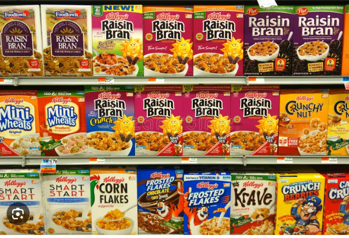

# CEREALS ANALYSIS

## Introduction:

This Power BI Project is an analysis of **80 different breakfast cereals**, with the goal of determining how to choose healthy and nutritious cereals. 
The dataset includes various attributes such as cereal name, manufacturer, calories, sugar content, and other nutritional information.

## Contents:

### The dataset contains the following fields:

-	Name: Name of cereal
-	mfr: Manufacturer
-	A = American Home Foods Products;
-	G = General Mills
-	K = Kelloggs
-	N = Nabisco
-	P = Post
-	Q = Quaker Oats
-	R = Ralston Purina

## type:

-	cold
-	hot
-	calories: calories per serving
-	protein: grams of protein
-	fat: grams of fat
-	carbo: grams of complex carbohydrates
-	sugars: grams of sugars
-	sodium: milligrams of sodium
-	fiber: grams of dietary fiber
-	potass: milligrams of potassium
-	vitamins: vitamins and minerals – 0, 25, or 100, indicating the percentage
  of recommended FDA
-	shelf: display shelf (1,2, or 3, counting from the floor)
-	weight: weight in ounces of one serving
-	cups: number of cups in one serving

## Problem Statement:

1.	which manufacturers produce cereals with the
    highest calories?
2.	which nutrients are most important for a cereal to
    receive a good rating?
3.	is there a relationship between sugars, calories, carbs, fat and cereal’s rating?
4.	which shelf has the highest number of cereals?

## Concepts demostrated:

The following Power BI features were incorporated:
-	DAX,
-	Filters,
-	Slicers,
-	Cards,
-	Insert

## Visualization:
Dashboard

